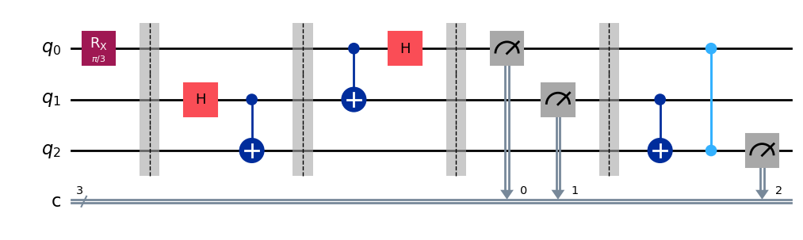
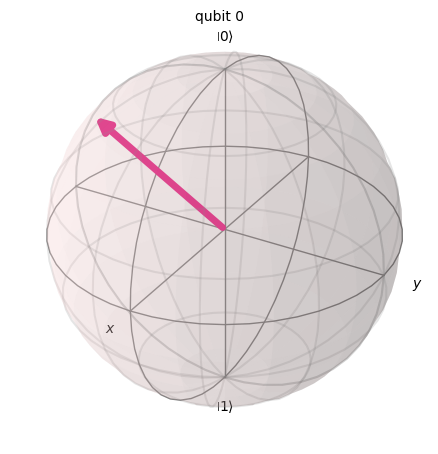

# Quantum Teleportation & State Visualization

A Python-based quantum computing project using IBM Qiskit to demonstrate the Quantum Teleportation Protocol. This project simulates the transfer of a quantum state from one qubit to another using entanglement and classical communication, along with 3D Bloch Sphere visualizations for state verification.

---

## Project Overview

Quantum teleportation is a foundational protocol in quantum information theory. It enables the transfer of an unknown quantum state \( |\psi\rangle \) from one qubit (Alice) to another qubit (Bob) using a shared entangled pair and classical communication.

This project focuses on conceptual clarity, state-level verification, and visual understanding of quantum mechanics through simulation rather than real hardware execution.

---

## Quantum Teleportation Circuit

The diagram below illustrates the complete quantum teleportation workflow, including state preparation, entanglement, Bell measurement, and correction operations.

<p align="center">
  
</p>

---

## Bloch Sphere State Visualization

The Bloch Sphere visualization confirms that the quantum state recovered by Bob matches the original state prepared on the message qubit.

<p align="center">
  
</p>

---

## Key Concepts Demonstrated

- Superposition  
  Preparing qubits in multiple states simultaneously using Hadamard (H) gates.

- Entanglement  
  Creating Bell pairs using Controlled-NOT (CX) gates.

- Reversible Logic  
  Demonstrating quantum gates as unitary, reversible transformations.

- Statevector Simulation  
  Extracting exact quantum states for verification before measurement collapse.

- Quantum Measurement and Correction  
  Recovering the original quantum state using classical bits and conditional gates.

---

## Tech Stack

- Language: Python 3.x  
- Framework: Qiskit  
- Backend: Qiskit Aer (high-performance simulator)  
- Environment: Google Colab / Jupyter Notebook  
- Visualization: Matplotlib, pylatexenc  

---

## Project Structure

| Component | Description |
|---------|-------------|
| State Preparation | Initializes the message qubit using rotation gates (RX). |
| Entanglement | Generates a Bell pair shared between Alice and Bob. |
| Bell Measurement | Alice performs Bell-basis measurements to transmit information. |
| Classical Communication | Measurement results are sent as classical bits. |
| Correction | Bob applies X and Z gates to recover the original state. |
| Visualization | Bloch Sphere plots show the transferred quantum state. |

---

## Installation and Usage

### Environment Setup

This project is optimized for Google Colab but also runs locally.

Install required dependencies:

```bash
pip install qiskit qiskit-aer pylatexenc

Running the Simulation

Initialize a 3-qubit quantum circuit representing the message, Alice, and Bob qubits.

Save the statevector using qc.save_statevector() to inspect the quantum state before measurement.

Execute the circuit using AerSimulator.

Visualize the state using plot_bloch_multivector().

Theory of Computation (TOC) Connection

In classical Theory of Computation, models such as Deterministic Finite Automata (DFA) exist in exactly one state at any given time.

This project demonstrates the Quantum Circuit Model, which generalizes classical computation:

Quantum states are vectors in a complex Hilbert space

Transitions are unitary matrices

Computation remains probabilistic until measurement

Quantum teleportation highlights the fundamental differences between classical and quantum information processing.

Possible Extensions

Introduce noise models to simulate real quantum hardware errors

Implement quantum algorithms such as Deutsch–Jozsa or Grover’s Algorithm

Deploy the simulation behind a FastAPI backend for Quantum-as-a-Service (QaaS) experiments

Execute the circuit on IBM Quantum real hardware

Author

Mahamad Zaid
Quantum Computing, AI, Systems and Applied ML